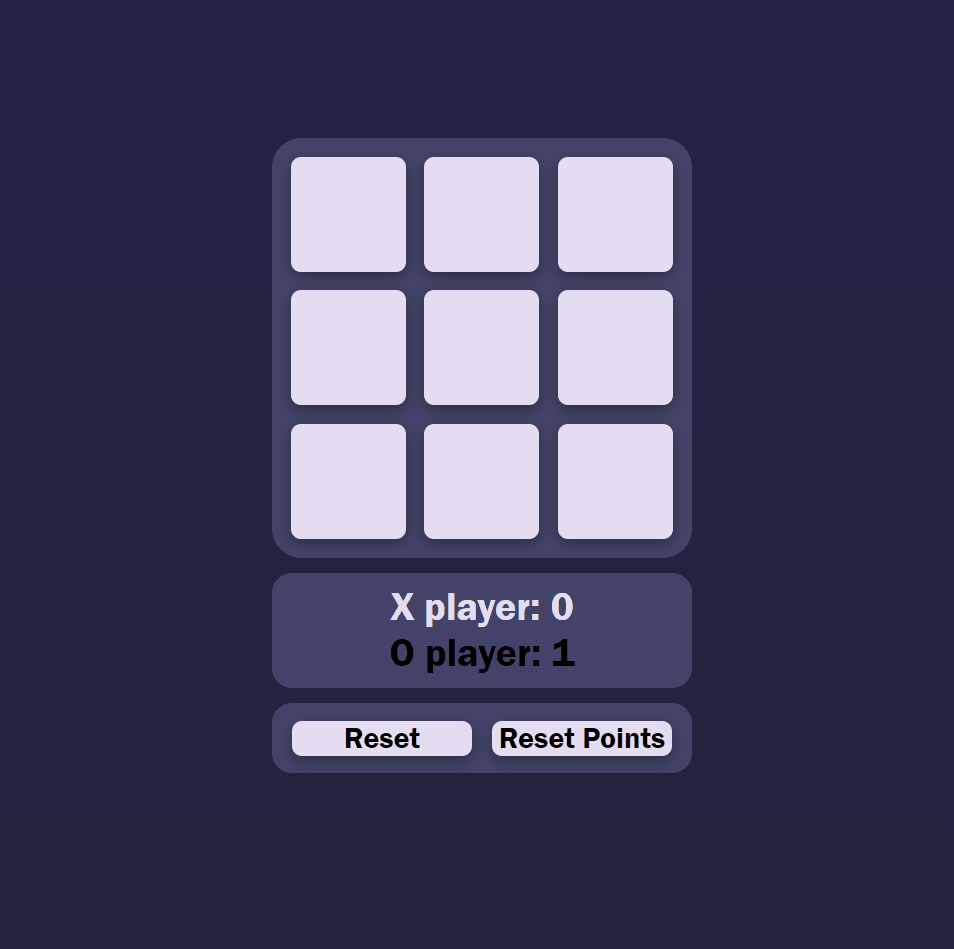

# TicTacToe

### Table of content

- [TicTacToe](#tictactoe)
  - [Table of content](#table-of-content)
  - [About The Project](#about-the-project)
    - [Tech Stack](#tech-stack)
    - [Functions](#functions)
  - [Play yourself](#play-yourself)

### About The Project

Its an simple tictactoe game project, I made through an intership.
It is the first time I made something in ReactJS and here is what it looks like:

#### Tech Stack

- HTML
- JavaScript
- CSS

#### Functions

* it checks if there are three "X" or "O" in a row (also diagonal)
* on winning the game, it shows an winning screen and counts a point to the winner
* on click reset (click on a field when won the game or draw) it resets the game
* on reset points it also resets the game, but it also sets both players points to zero
* the points are saved to the local-storage

#### Experimental

* Login

### Play yourself

- [TicTacToe](https://craftedking144.github.io/tictactoereact/)
